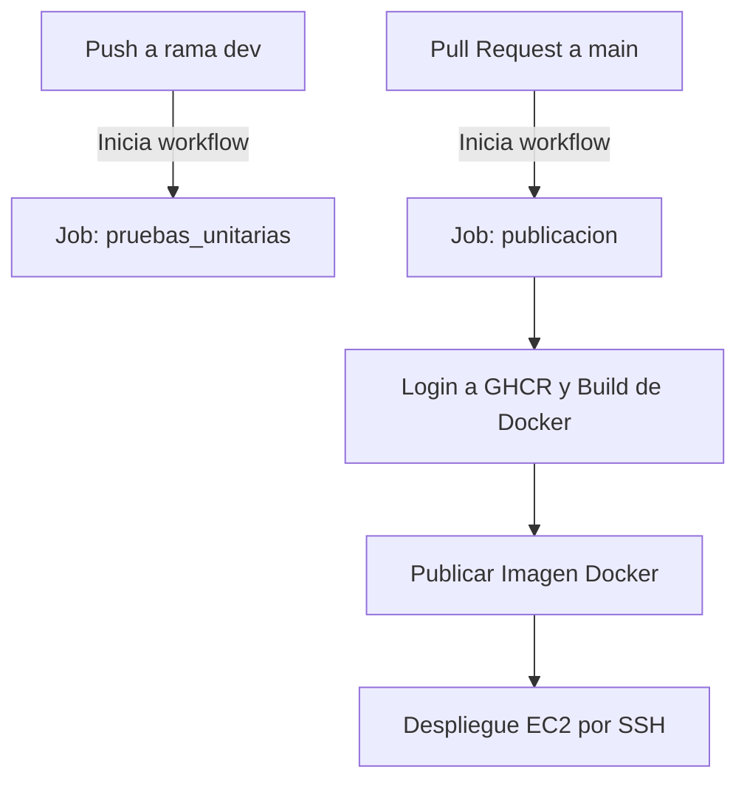

# 🤖 MLOpsApp - Pipeline CI/CD con GitHub Actions

Este proyecto contiene una aplicación basada en modelos de aprendizaje profundo y está integrado con un pipeline de **CI/CD automatizado usando GitHub Actions**.

El objetivo es garantizar un flujo de desarrollo robusto, con pruebas automáticas en cada cambio, y despliegues controlados al entorno de producción mediante contenedores Docker en una instancia EC2.

---

## 📌 ¿Qué hace este workflow?

| Evento                  | Acción                                                    |
|--------------------------|-----------------------------------------------------------|
| `push` a `dev`           | 🧪 Ejecuta pruebas unitarias                              |
| `pull request` a `main`  | 🐳 Despliega en servidor EC2 vía Docker                  |

---

## 🧭 Diagrama del flujo CI/CD



---

## ⚙️ Estructura del Workflow

Archivo ubicado en: `.github/workflows/deploy.yml`

### 🧪 `Job: pruebas_unitarias`
Se ejecuta al hacer `push` en la rama `dev`.

**Acciones:**
- Instala dependencias con `pip install -r requirements.txt`.
- Configura el entorno para acceder a un modelo ONNX en un bucket S3.
- Ejecuta pruebas unitarias con `pytest`.

**Variables usadas:**
- `S3_BUCKET_NAME`
- `S3_MODEL_KEY`
- `AWS_ACCESS_KEY_ID`
- `AWS_SECRET_ACCESS_KEY`

---

### 🐳 `Job: publicacion`
Se ejecuta **solo si haces un Pull Request hacia `main`**.

**Acciones:**
1. Instala dependencias y herramientas necesarias.
2. Construye una imagen Docker etiquetada con el nombre del branch.
3. Publica la imagen en [GitHub Container Registry (GHCR)](https://ghcr.io/).
4. Se conecta vía SSH a un servidor EC2 y:
   - Detiene el contenedor actual (`mlopsapp`).
   - Descarga la nueva imagen.
   - Ejecuta el nuevo contenedor con variables de entorno necesarias.

---

## 🔐 Secrets Requeridos

Debes definir los siguientes secretos en GitHub (`Settings > Secrets > Actions`):

| Nombre                    | Descripción                        |
|---------------------------|------------------------------------|
| `AWS_ACCESS_KEY_ID`       | Llave pública para acceso a S3     |
| `AWS_SECRET_ACCESS_KEY`   | Llave privada para S3              |
| `GITHUB_TOKEN`            | Token para autenticación con GHCR  |
| `EC2_HOST`                | IP pública o DNS del servidor EC2  |
| `EC2_USER`                | Usuario SSH (ej. `ubuntu`)         |
| `EC2_KEY`                 | Clave privada SSH (formato PEM)    |

---

## 🧪 Ejemplo de prueba unitaria

Tu código incluye pruebas como esta:

```python
def test_classify_image_from_s3():
    response = client.post("/predict", files={"file": open("test_image.jpg", "rb")})
    assert response.status_code == 200
    assert "class" in response.json()
```

Esto valida que tu endpoint `/predict` funcione correctamente con una imagen enviada.

---

## 🖼️ Ejemplo de ejecución

```bash
# Push a dev
git checkout dev
git commit -am "Agrega test"
git push origin dev
# Ejecuta pruebas

# Pull request a main
gh pr create --base main --head dev --title "Deploy a producción"
# Despliega automáticamente en EC2
```

---

## 💡 Recomendaciones

- Nunca hagas push directo a `main`. Usa Pull Requests.
- Asegúrate de que las pruebas pasen en `dev` antes de hacer un PR.
- Puedes añadir validaciones extra como linting o seguridad en etapas futuras.

---

## 🧠 Pensado para proyectos MLOps

Este workflow está diseñado para proyectos de Machine Learning en producción que:
- Usan modelos ONNX almacenados en S3.
- Sirven inferencias vía Flask o FastAPI.
- Se despliegan con Docker en la nube (EC2).

---

## 📄 Licencia

Este proyecto está bajo la licencia MIT.

---

## 👩‍💻 Autor

Claudia - MLOps Enthusiast 🚀
