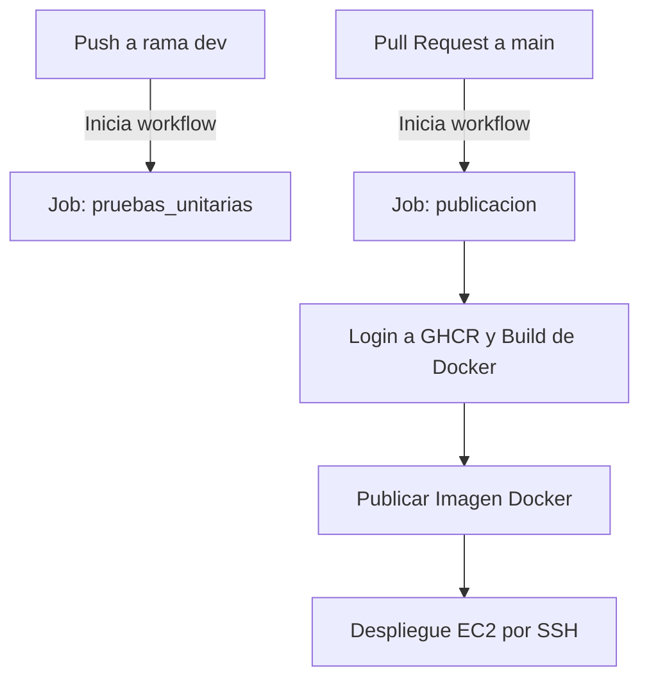

# 🤖 MLOpsApp - Pipeline CI/CD con GitHub Actions

Este proyecto contiene una aplicación basada en modelos de aprendizaje profundo y está integrado con un pipeline de **CI/CD automatizado usando GitHub Actions**.

El objetivo es garantizar un flujo de desarrollo robusto, con pruebas automáticas en cada cambio, y despliegues controlados al entorno de producción mediante contenedores Docker en una instancia EC2.

# 📦 MLOps: Auto Deploy Model con Flask, ONNX, Docker y GitHub Actions

Este repositorio contiene una aplicación de clasificación de imágenes utilizando un modelo **DenseNet121** en formato **ONNX**. Incluye un entorno MLOps completo con:

- **Flask** para servir el modelo.
- **Docker** para contenerización.
- **AWS S3** para almacenamiento de modelos e imágenes.
- **GitHub Actions** para CI/CD automático.

---

## 🚀 Características

- Descarga el modelo ONNX e imágenes de prueba desde un bucket S3.
- Expone una API con Flask para clasificar imágenes.
- Incluye pruebas unitarias con Pytest.
- CI/CD con GitHub Actions: test, build, push y despliegue en EC2.

---


## 📌 ¿Qué hace este workflow?

| Evento                  | Acción                                                    |
|--------------------------|-----------------------------------------------------------|
| `push` a `dev`           | 🧪 Ejecuta pruebas unitarias                              |
| `pull request` a `main`  | 🐳 Despliega en servidor EC2 vía Docker                  |

---

## 🧭 Diagrama del flujo CI/CD


---

## 🚀 Características

- Descarga el modelo ONNX e imágenes de prueba desde un bucket S3.
- Expone una API con Flask para clasificar imágenes.
- Incluye pruebas unitarias con Pytest.
- CI/CD con GitHub Actions: test, build, push y despliegue en EC2.

---

## 📦 Requisitos

- Docker
- Python 3.9+
- AWS CLI configurado si pruebas localmente

---
## 🐳 Construcción y ejecución con Docker

```bash
docker build -t mlopsapp .
docker run -p 5000:5000 mlopsapp
```
---

## ☁️ Despliegue automático

- Al hacer **push a `dev`** → Se ejecutan **pruebas unitarias**.
- Al hacer **pull request hacia `main`** → Se ejecuta **build Docker + despliegue EC2**.

---

## ✉️ Endpoint Flask

`POST /predict`

- Body: `multipart/form-data`
- Campo: `image`
- Respuesta: JSON con clase predicha y probabilidad

---

## ⚙️ Estructura del Workflow

Archivo ubicado en: `.github/workflows/ci.yml`

### 🧪 `Job: pruebas_unitarias`
Se ejecuta al hacer `push` en la rama `dev`.

**Acciones:**
- Instala dependencias con `pip install -r requirements.txt`.
- Configura el entorno para acceder a un modelo ONNX en un bucket S3.
- Ejecuta pruebas unitarias con `pytest`.

**Variables usadas:**
- `S3_BUCKET_NAME`
- `S3_MODEL_KEY`
- `AWS_ACCESS_KEY_ID`
- `AWS_SECRET_ACCESS_KEY`

---

### 🐳 `Job: publicacion`
Se ejecuta **solo si haces un Pull Request hacia `main`**.

**Acciones:**
1. Instala dependencias y herramientas necesarias.
2. Construye una imagen Docker etiquetada con el nombre del branch.
3. Publica la imagen en [GitHub Container Registry (GHCR)](https://ghcr.io/).
4. Se conecta vía SSH a un servidor EC2 y:
   - Detiene el contenedor actual (`mlopsapp`).
   - Descarga la nueva imagen.
   - Ejecuta el nuevo contenedor con variables de entorno necesarias.

---

## 🔐 Secrets Requeridos

Debes definir los siguientes secretos en GitHub (`Settings > Secrets > Actions`):

| Nombre                    | Descripción                        |
|---------------------------|------------------------------------|
| `AWS_ACCESS_KEY_ID`       | Llave pública para acceso a S3     |
| `AWS_SECRET_ACCESS_KEY`   | Llave privada para S3              |
| `GITHUB_TOKEN`            | Token para autenticación con GHCR  |
| `EC2_HOST`                | IP pública o DNS del servidor EC2  |
| `EC2_USER`                | Usuario SSH (ej. `ubuntu`)         |
| `EC2_KEY`                 | Clave privada SSH (formato PEM)    |

---

## 🧪 Ejemplo de prueba unitaria

Tu código incluye pruebas como esta:

```python
def test_classify_image_from_s3():
    response = client.post("/predict", files={"file": open("test_image.jpg", "rb")})
    assert response.status_code == 200
    assert "class" in response.json()
```

Esto valida que tu endpoint `/predict` funcione correctamente con una imagen enviada.

---

## 🖼️ Ejemplo de ejecución

```bash
# Push a dev
git checkout dev
git commit -am "Agrega test"
git push origin dev
# Ejecuta pruebas

# Pull request a main
gh pr create --base main --head dev --title "Deploy a producción"
# Despliega automáticamente en EC2
```
---
## 🗂️ Estructura del Proyecto MLOPS

mlops-auto-deploy-model/
├── .github/
│   └── workflows/
│       └── ci-cd.yml                # ⚙️ Workflow de GitHub Actions para CI/CD
├── app.py                           # 🧠 API Flask que carga el modelo y realiza inferencia
├── docker/
│   └── Dockerfile                   # 🐳 Imagen Docker para contenerizar la app
├── onnx_models/                     # 📦 Carpeta de modelos descargados dinámicamente desde S3
│   └── (vacía por defecto)
├── tests/
│   └── test_model.py                # 🧪 Pruebas unitarias con Pytest
├── utils/
│   ├── classifier.py                # 🔍 Clasificador que usa ONNX para predecir
│   ├── image_utils.py               # 🖼️ Funciones de preprocesamiento de imagen
│   └── s3_utils.py                  # ☁️ Funciones de descarga desde AWS S3
├── requirements.txt                 # 📜 Dependencias de Python
├── README.md                        # 📖 Documentación del proyecto (por crear o actualizar)
└── .gitignore                       # 🚫 Archivos ignorados por Git
----
 ---
## 📝 Descripción de Carpetas y Archivos

| Carpeta/Archivo        | Descripción                                               |
| ---------------------- | --------------------------------------------------------- |
| `.github/workflows/`   | Contiene el archivo YAML que define el pipeline CI/CD.    |
| `app.py`               | App Flask principal. Carga modelo ONNX y expone la API.   |
| `docker/Dockerfile`    | Define cómo construir la imagen Docker de la app.         |
| `onnx_models/`         | Carpeta donde se descargan los modelos desde S3.          |
| `tests/test_model.py`  | Pruebas unitarias usando `pytest` que validan inferencia. |
| `utils/classifier.py`  | Función que carga y ejecuta el modelo ONNX.               |
| `utils/image_utils.py` | Preprocesa la imagen para adaptarla al modelo.            |
| `utils/s3_utils.py`    | Funciones para descargar modelo e imágenes desde S3.      |
| `requirements.txt`     | Lista de dependencias requeridas por la aplicación.       |
| `.gitignore`           | Archivos/carpetas que no deben incluirse en el repo.      |


---

## 💡 Recomendaciones

- Nunca hagas push directo a `main`. Usa Pull Requests.
- Asegúrate de que las pruebas pasen en `dev` antes de hacer un PR.
- Puedes añadir validaciones extra como linting o seguridad en etapas futuras.

---

## 🧠 Pensado para proyectos MLOps

Este workflow está diseñado para proyectos de Machine Learning en producción que:
- Usan modelos ONNX almacenados en S3.
- Sirven inferencias vía Flask.
- Se despliegan con Docker en la nube (EC2).

---

## 📄 Licencia

Este proyecto está bajo la licencia MIT.

---

## 👩‍💻 Autor

Claudia Martinez- Enrique Manzano MLOps Enthusiast 🚀
